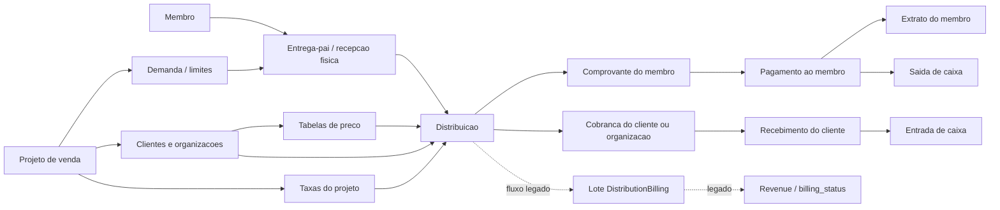
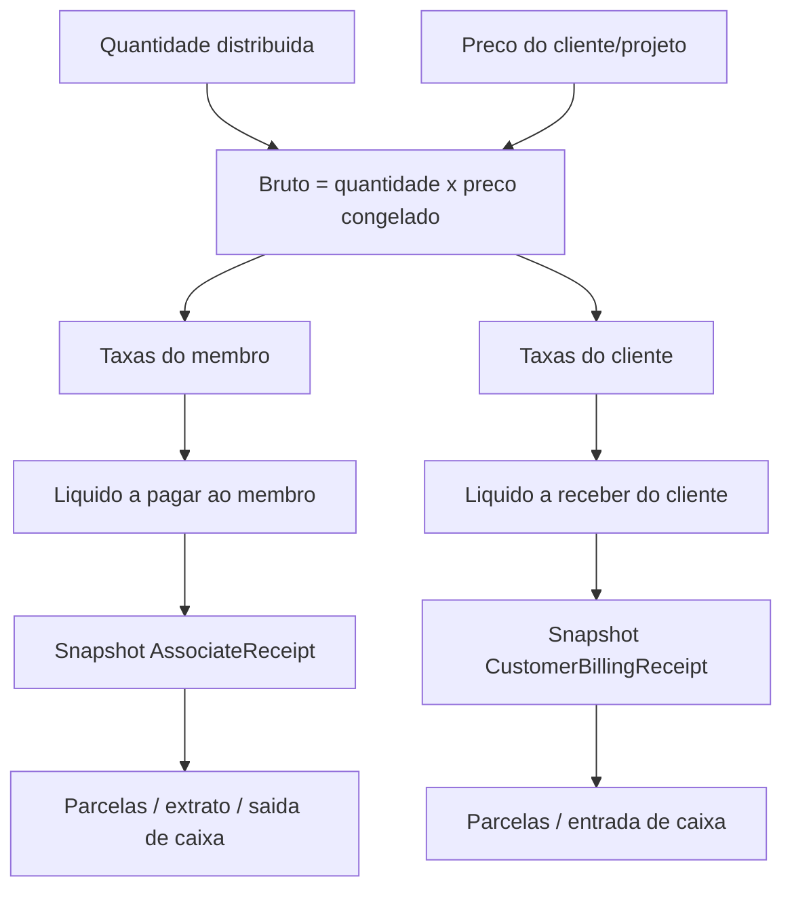

# Auditoria Arquitetural do Fluxo Financeiro de Projetos de Venda

**Data:** 19/08/2026  
**Escopo:** projetos de venda, entregas, distribuicoes, comprovantes, cobrancas, faturamento, pagamentos, documentos e preparacao para um futuro Portal de Contabilidade e Prestacao de Contas.  
**Decisao desta fase:** nenhuma migration, tabela, coluna, enum, status ou fluxo novo foi criado.

## Resumo executivo

O SGC ja possui quase todos os conceitos operacionais necessarios para que um futuro Portal Contabil funcione como camada de orquestracao. A arquitetura correta ja esta expressa no codigo:

- a entrega-pai representa a recepcao fisica;
- a distribuicao, gravada em `production_deliveries` com `parent_delivery_id`, representa quantidade, destino, preco e fato financeiro;
- `PricingService` resolve o preco por cliente/projeto;
- `ProjectFinancialCalculator` centraliza taxas, descontos, acrescimos e liquido;
- comprovantes de membro e cobrancas de cliente congelam totais e taxas;
- pagamentos geram extrato e/ou movimento de caixa;
- PDFs, modelos, documentos, armazenamento por tenant e auditoria ja possuem bases reutilizaveis.

O Portal Contabil **nao deve ser iniciado ainda**. Ha quatro bloqueadores estruturais:

1. **Todas as tabelas financeiras inspecionadas no banco local estao em MyISAM.** O servidor informa `@@default_storage_engine = MyISAM`; nao ha nenhuma foreign key efetiva no schema. Assim, `DB::transaction()` e `lockForUpdate()` nao entregam atomicidade ou bloqueio de linha nessas tabelas.
2. **O mesmo `billing_status` mistura contas a pagar e contas a receber.** Ele pode ser alterado por lote legado, pagamento ao membro, recebimento do cliente e acoes administrativas.
3. **Os dois lados documentais sao acoplados de forma assimetrica.** Uma cobranca de cliente criada primeiro bloqueia o comprovante do membro; o caminho inverso nao tem a mesma regra.
4. **Existem inconsistencias reais no banco local:** 19 de 23 comprovantes de membro apresentam diferenca entre `delivery_ids` e a FK das distribuicoes; oito distribuicoes ativas apontam para cobrancas inexistentes; dois comprovantes `paid` possuem `amount_paid = 0`; cinco entregas antigas possuem lancamentos duplicados no extrato.

Classificacao geral: **NO-GO para o Portal Contabil ate concluir o saneamento e o endurecimento transacional.** O fluxo operacional atual pode continuar, mas nao deve receber uma nova camada contabil antes dessas correcoes.

---

## A. Arquitetura atual

O nucleo utiliza Laravel/Eloquent, Filament para administracao e portais Blade/AJAX para operacao. O isolamento e aplicado principalmente por `tenant_id`, `BelongsToTenant`, filtros explicitos nos controllers e permissoes do Shield.

Os fatos hoje se distribuem em cinco camadas:

1. **Planejamento:** `sales_projects`, demandas, participantes, cotas, clientes, organizacoes, precos e taxas.
2. **Operacao fisica:** recepcao em `production_deliveries.parent_delivery_id = NULL`.
3. **Fato financeiro:** distribuicao em `production_deliveries.parent_delivery_id IS NOT NULL`.
4. **Documentos financeiros:** `associate_receipts` e `customer_billing_receipts`.
5. **Liquidacao:** pagamentos parciais, extrato do membro, movimentos de caixa e estruturas legadas.

Ha dois fluxos financeiros paralelos ainda ativos:

- fluxo atual: distribuicao -> comprovante -> pagamento/recebimento;
- fluxo legado: distribuicao -> `distribution_billings`/`project_payments` -> status/lancamentos.

O `FinancialReceipt` e uma terceira entidade, mas tem finalidade diferente e valida: recibo de entrada financeira livre da organizacao, sem depender de distribuicao de projeto.

## B. Diagrama do fluxo atual

Regra que deve permanecer: **somente `X`, a distribuicao, carrega o fato financeiro operacional.**

## C. Tabelas envolvidas

| Tabela | Finalidade efetiva | Ownership | Financeiro/status | Auditoria/documento | Exclusao/dependencias |
|---|---|---|---|---|---|
| `tenants` | Organizacao interna dona dos dados | PK `id` | configuracoes gerais | identidade e arquivos | raiz do isolamento |
| `sales_projects` | Ciclo comercial e operacional | `tenant_id` | teto, taxa base, status, numeracao | configuracoes de PDF e Drive | `SoftDeletes`; varias relacoes dependem dela |
| `sales_project_customers` | Clientes individuais autorizados | projeto + cliente | sem valor | timestamps | pivot; ownership inferido |
| `sales_project_organizations` | Organizacoes compradoras participantes | projeto + organizacao | limite de solicitacao | timestamps | pivot; ownership inferido |
| `project_demands` | Meta de produto/cliente | tenant + projeto | quantidade-meta e `unit_price` historico | datas/observacoes | `SoftDeletes`; `delivered_quantity` e derivado |
| `project_associates` | Participacao e teto do membro | tenant + projeto + membro | limite financeiro/status | created/updated by | vinculo operacional |
| `project_associate_product_limits` | Cota de produto por membro | tenant + projeto + membro + produto | quantidade e preco de referencia | autores/status | planejamento, nao fato financeiro |
| `price_tables` / `price_table_items` | Preco disponivel por cliente/projeto | tenant e relacionamentos | preco de venda/custo | status/vigencia | origem do preco; nao deve reescrever historico |
| `project_fees` | Taxas do lado do membro | tenant + projeto | percentual/fixo, desconto/acrescimo | ativo/ordem/nome de coluna | `SoftDeletes` |
| `customer_project_fees` | Taxas do lado do cliente | tenant + projeto | percentual/fixo, desconto/acrescimo | ativo/ordem/nome de coluna | deve permanecer separado das taxas do membro |
| `production_deliveries` | Recepcao e distribuicao na mesma tabela | tenant + projeto + membro | quantidade, preco, bruto gerado, taxas, liquido e varios vinculos | autores, aprovacao, observacoes | `SoftDeletes`; entidade central e mais sensivel |
| `associate_receipts` | Comprovante/conta a pagar do membro | tenant + projeto + membro | snapshot total, taxas, status e pago | numeracao, datas, obsolescencia | sem `SoftDeletes`; FKs pretendidas em cascata |
| `associate_receipt_payments` | Parcelas pagas ao membro | tenant + comprovante | valor/metodo/conta | autor/documento/data | historico de liquidacao |
| `customer_billing_receipts` | Cobranca/conta a receber por cliente ou organizacao | tenant + projeto + destinatario | snapshot total, taxas, status e recebido | numeracao, periodo, autor | sem `SoftDeletes`; destinatario pode ficar nulo |
| `customer_receipt_payments` | Parcelas recebidas do cliente | tenant + cobranca | valor/metodo/conta | autor/documento/data | historico de liquidacao |
| `distribution_billings` | Lote legado de faturamento por distribuicao/membro | tenant + projeto | totais e snapshot | referencia, periodo, autor | `SoftDeletes`; ainda acionavel no Filament |
| `project_payments` | Pagamentos/recebimentos legados do projeto | tenant + projeto | tipo, valor, saldo e status | aprovacao/finalizacao | `SoftDeletes`; sobrepoe fluxos atuais |
| `associate_ledgers` | Extrato corrido do membro | tenant + membro | credito/debito e `balance_after` | referencia polimorfica/autor | `SoftDeletes`; saldo denormalizado |
| `bank_accounts` | Conta ou caixa | tenant | saldo atual | status | recebe atualizacao incremental |
| `cash_movements` | Entrada, saida e transferencia | tenant + conta | valor e `balance_after` | referencia polimorfica/autor | `SoftDeletes`; base de conciliacao |
| `financial_receipts` / itens | Recibo livre de recebimento da associacao | tenant | valor manual/itens, emissao e estorno | numeracao, autores, motivo | fluxo novo mais rigoroso; sem delete direto |
| `documents` | Anexos polimorficos, inclusive nota fiscal | tenant + `documentable` | sem calculo | categoria, arquivo, autor | `SoftDeletes`; reutilizavel para fiscal |
| `cloud_documents` | Espelho organizado no Drive por tenant | tenant + documento | sem calculo | provider, caminho e checksum | reutilizavel para arquivos finais |
| `document_templates` / `generated_documents` | Modelos e documentos gerados | tenant + tipo/projeto | apenas apresentacao | versao de conteudo/autor | reutilizavel para prestacao de contas |
| `activity_log` | Auditoria transversal | tenant em coluna/properties | antes/depois quando configurado | ator/data/acao | deve ser preservado |
| `buyer_requests` / itens | Solicitacao da organizacao compradora | tenant + projeto + organizacao | meta, nao venda | status e autor | atendimento derivado de distribuicoes |
| `organization_authorized_emails` | Acesso ao portal comprador | tenant + organizacao | nenhum | ultimo login/status | base reutilizavel para autorizacao externa |

### Colunas com sobreposicao ou uso legado

- `production_deliveries.paid`, `paid_date` e `project_payment_id` coexistem com `associate_receipt_id`, pagamentos parciais e `billing_status`.
- `distribution_billing_id` continua ativo ao lado dos dois tipos de comprovante.
- `project_demands.unit_price` e util para planejamento, mas nao deve substituir o preco congelado da distribuicao.
- `associate_receipts.delivery_ids` e `customer_billing_receipts.delivery_ids` duplicam a associacao representada pelas FKs nas distribuicoes.
- `balance_after` em extrato e caixa e uma cache acumulada; exige serializacao real para permanecer confiavel.

## D. Models e relacionamentos

### Relacao principal

`SalesProject` possui demandas, clientes, organizacoes, membros participantes, cotas, taxas, entregas, pagamentos, comprovantes de membro e cobrancas de cliente.

`ProductionDelivery` possui dois papeis:

- recepcao: `parent_delivery_id = NULL`;
- distribuicao: `parent_delivery_id = entrega-pai`, com cliente, preco e valores.

A distribuicao pertence a uma entrega-pai, projeto, membro, produto e cliente; pode apontar para:

- `associate_receipt_id`;
- `billing_receipt_id`;
- `distribution_billing_id`;
- `project_payment_id`.

Essa multiplicidade permite rastreamento, mas os significados se sobrepoem.

### Isolamento dos models

`SalesProject`, `ProductionDelivery`, `DistributionBilling`, `ProjectPayment`, `AssociateLedger`, `CashMovement`, `Document` e entidades operacionais usam `BelongsToTenant`.

`AssociateReceipt` e `CustomerBillingReceipt` **nao usam `BelongsToTenant`**. Seus Resources usam `TenantScoped`, mas o model e os services nao recebem protecao global equivalente. A `AssociateReceiptPolicy` verifica permissao Shield, sem comparar tenant. Nao foi localizada policy dedicada para `CustomerBillingReceipt`.

O trait `TenantScoped` permite ao `super_admin` consultar todos os tenants, mesmo com tenant selecionado. Isso deve ser uma decisao explicita e testada, nao um efeito lateral do Resource.

## E. Fluxo do valor

1. **Quantidade fisica:** nasce na entrega-pai.
2. **Quantidade vendida:** nasce na distribuicao; o controller bloqueia soma acima da recepcao e repete a verificacao apos `lockForUpdate`.
3. **Destino:** `customer_id` da distribuicao; organizacao e derivada do cliente.
4. **Preco:** `PricingService::resolvePrice(product, customer, project)`; `unit_price`, `price_table_id` e `price_source` sao persistidos na distribuicao.
5. **Bruto:** coluna gerada `quantity * unit_price` em `production_deliveries`.
6. **Taxas do membro:** `ProjectFinancialCalculator`, usando taxa administrativa base mais `project_fees` ativos.
7. **Liquido do membro:** bruto - descontos + acrescimos; persiste na distribuicao e no snapshot do comprovante.
8. **Taxas do cliente:** `customer_project_fees`; sem taxas configuradas, bruto = liquido.
9. **Documento:** o comprovante congela totais e estrutura de taxas, mas ainda referencia as distribuicoes originais.
10. **Liquidacao:** parcela cria pagamento; no lado do membro gera `AssociateLedger` e opcional saida de caixa; no lado cliente gera entrada de caixa.

Ha uma divergencia no lado do cliente: `CustomerBillingReceiptService` afirma aplicar somente `customer_project_fees`, mas, quando essa colecao nao esta vazia, chama `calculateWithFees($project, ...)`; este metodo encaminha o projeto para `applyFees()` e inclui tambem `admin_fee_percentage`. Sem taxas de cliente, a cobranca nao aplica taxa alguma; com uma taxa de cliente, passa a aplicar essa taxa **e** a taxa administrativa base. Esse comportamento descontínuo precisa ser corrigido ou formalmente assumido antes de faturar.

### Snapshot e recalculo

- O preco historico e preservado em `production_deliveries.unit_price`.
- Totais e taxas sao congelados nos comprovantes.
- `ReceiptDataBuilder` pode recalcular linhas usando as distribuicoes atuais e o snapshot de taxas. Portanto, o snapshot do comprovante **nao e um snapshot imutavel completo de cada linha**.
- Se uma alteracao indevida atingir quantidade ou preco depois da emissao, uma reimpressao pode divergir do documento original, mesmo que `total_net` esteja congelado.
- A sincronizacao no Drive usa nome estavel e pode atualizar o arquivo; nao equivale, por si so, a versionamento legal imutavel.

## F. Fluxo do comprovante do membro

1. Seleciona somente distribuicoes aprovadas.
2. Valida tenant, projeto, membro, entrega-pai, cliente, quantidade e preco.
3. Calcula snapshot por `AssociateReceiptService`.
4. Grava totais e `fee_snapshot`.
5. Vincula `associate_receipt_id` e sincroniza `delivery_ids`.
6. Define `pending_payment`.
7. Alteracao operacional pode marcar `obsolete` e exigir regeneracao.
8. Pagamento parcial cria uma parcela, credito no extrato e opcional saida de caixa.
9. Quitacao define `paid` e altera `billing_status` das distribuicoes para `paid`.

Pontos positivos: comprovante parcial e suportado; a entrega-pai e excluida; o PDF agrupa distribuicoes; existe obsolescencia; o Resource bloqueia editar/excluir quando ha trava financeira.

Lacunas:

- pagamento parcial nao bloqueia comprovante, conta bancaria nem ultimo saldo antes da soma;
- `payReceipt()` e `addPayment()` nao sao idempotentes;
- nao ha constraint unica para impedir repeticao do mesmo evento;
- exclusao e desvinculacao nao estao em uma operacao atomica efetiva;
- comprovante nao possui `SoftDeletes` e as migrations pretendem cascata por projeto/membro;
- policy nao valida ownership do registro;
- o PDF historico depende das linhas atuais.

## G. Fluxo da cobranca do cliente

`CustomerBillingReceipt` representa uma cobranca consolidada de distribuicoes para **um cliente ou uma organizacao**, por projeto e periodo. Possui numeracao, selecao de distribuicoes, snapshot, PDF/Excel e pagamentos parciais.

Fluxo atual:

1. rascunho (`draft`);
2. emissao por `freezeReceipt()`;
3. `pending_payment`;
4. pagamentos parciais;
5. `partially_paid` ou `paid`;
6. entrada proporcional no caixa quando uma conta e informada.

Lacunas:

- nao ha estados de enviado, autorizado, correcao solicitada, documento fiscal emitido ou cancelado;
- nao ha cancelamento/estorno formal da cobranca;
- a regra declarada de taxas do cliente diverge da implementacao quando existe ao menos uma `customer_project_fee`;
- `freezeReceipt()` valida muito menos invariantes que o service do membro;
- nao confirma dentro do service tenant, projeto, cliente, preco, quantidade e contagem dos IDs;
- editar o rascunho altera `delivery_ids`, mas a pagina de edicao nao sincroniza claramente as FKs;
- excluir usa a lista JSON para liberar FKs, sem transacao;
- a migration comenta sobre indice unico parcial, mas apenas cria indice comum;
- cliente/organizacao usam `nullOnDelete` pretendido, o que perderia a referencia direta sem um snapshot do destinatario.

## H. Fluxo de faturamento atual

Existem tres significados concorrentes:

1. `distribution_billings`: lote explicito que marca distribuicao como `billed` e cria receita de taxa pendente;
2. `billing_receipt_id`: distribuicao incluida em cobranca do cliente, sem necessariamente alterar `billing_status`;
3. `billing_status = paid`: usado quando o membro foi pago **ou** quando o cliente quitou.

Assim, hoje `billed` nao significa de forma unica “entrou em cobranca”, “foi autorizado”, “teve nota emitida” ou “foi recebido”. O nome deve ser tratado como legado/ambigua ate uma separacao conceitual.

`project_payments` ainda registra `client_payment` e `associate_payment`; isso se sobrepoe aos pagamentos de comprovantes. No banco local ha quatro pagamentos legados de membro e dois recebimentos legados de cliente.

## I. Status atuais

| Entidade | Status | Significado real | Quem/acao altera | Retorno | Efeito financeiro |
|---|---|---|---|---|---|
| entrega/distribuicao | `pending` | aguardando aprovacao | registrador/acao aprovar | sim | nenhum |
| entrega/distribuicao | `approved` | fisico aceito ou venda distribuida | aprovacao/distribuicao | limitado | habilita documentos |
| entrega/distribuicao | `rejected` | recusada | registrador | pode excluir/corrigir | nenhum |
| entrega/distribuicao | `cancelled` | cancelada | fluxo administrativo | controlado | deve excluir dos totais |
| distribuicao | `unbilled` | nao travada pelo status compartilhado | criacao/desvinculo | sim | ainda disponivel conforme FKs |
| distribuicao | `billed` | incluida em lote legado | `DistributionBillingService` | sem rotina central clara | cria lote/receita pendente |
| distribuicao | `paid` | liquidada em algum dos lados | services e acoes Filament | deve exigir estorno | trava edicao |
| comprovante membro | `draft` | criado sem fechamento | criacao | sim | nenhum |
| comprovante membro | `pending_payment` | snapshot gerado | freeze/regeneracao | pode ficar obsoleto | conta a pagar |
| comprovante membro | `obsolete` | documento precisa regenerar | alteracao de distribuicao | sim | nao deveria liquidar |
| comprovante membro | `partially_paid` | parcialmente liquidado | pagamento | nao editavel | credito/caixa parcial |
| comprovante membro | `paid` | quitado | pagamento | nao | credito/caixa total |
| cobranca cliente | `draft` | selecao editavel | criacao | sim | nenhum |
| cobranca cliente | `pending_payment` | emitida | freeze | nao editavel | conta a receber |
| cobranca cliente | `partially_paid` | parcialmente recebida | recebimento | nao | caixa parcial |
| cobranca cliente | `paid` | recebida | recebimento | nao | caixa total |
| projeto | `draft/active/suspended` | ciclo de operacao | administracao | conforme regra | controla operacao |
| projeto | `deliveries_closed/completed/archived/cancelled` | encerramentos distintos | administracao | limitado | deve bloquear novas operacoes |
| pagamento legado | `pending/deposited/paid/cancelled` | estado de pagamento generico | Filament | variavel | paralelo ao fluxo atual |

## J. Pontos fortes a preservar

- Distribuicao como fonte financeira, com entrega-pai apenas fisica.
- Preco por cliente/projeto congelado na distribuicao.
- Motor financeiro central com BCMath e suporte a desconto/acrescimo.
- Separacao entre taxas do membro e taxas do cliente.
- Comprovantes parciais e pagamentos parciais.
- Validacao de quantidade sob lock no controller de distribuicao.
- Central de pendencias e `DeliveryProjectIntegrityService`.
- Numeracao dupla por tenant/projeto.
- Templates de PDF por tenant/tipo de projeto.
- Portal comprador, participacao por organizacao e e-mails autorizados.
- `FinancialReceiptService` como bom exemplo de emissao/cancelamento/estorno.
- Documentos polimorficos, Google Drive por tenant e logs de atividade.
- Testes de verdade financeira, relatatorios, PDFs e isolamento do recibo financeiro.

## K. Duplicidades existentes

1. `delivery_ids` JSON e FK nas distribuicoes.
2. `paid`, `paid_date`, `billing_status`, status do comprovante e `project_payment_id` representam partes da liquidacao.
3. `DistributionBilling`, `AssociateReceipt` e `ProjectPayment` cobrem o lado do membro.
4. `CustomerBillingReceipt`, `ProjectPayment(client_payment)` e `FinancialReceipt` podem parecer recebimentos, embora o ultimo tenha finalidade livre.
5. Totais persistidos na distribuicao, comprovante, lote, extrato, movimento e telas.
6. Somatorios diretos de `gross_value/net_value` continuam espalhados por controllers e paginas, fora de `ReceiptDataBuilder`.

## L. Regras conflitantes

- `AssociateReceiptService` bloqueia distribuicao com qualquer `billing_receipt_id`; `CustomerBillingReceiptService` nao bloqueia a existencia de `associate_receipt_id`. O resultado depende da ordem.
- `billing_status` e compartilhado pelos dois lados financeiros.
- a cobranca sem `customer_project_fees` nao desconta nada, mas a cobranca com uma taxa de cliente tambem incorpora `admin_fee_percentage`, apesar de o service declarar o contrario.
- `CustomerReceiptStatus::pending_payment` e imutavel, enquanto comprovante do membro pendente ainda admite atualizacao controlada.
- taxas historicas sao congeladas, mas linhas do documento ainda podem ser recalculadas.
- comentarios das migrations afirmam FKs/indices que o schema MyISAM nao possui.
- `BelongsToTenant` libera consultas sem escopo quando nao existe tenant em sessao; isso e pratico em jobs, mas perigoso para services que nao filtram explicitamente.

## M. Riscos de integridade

### Criticos

1. **MyISAM em todo o nucleo:** zero foreign keys efetivas e ausencia de transacoes/row locks.
2. **Vinculos orfaos reais:** oito distribuicoes ativas `paid` apontam para cobrancas inexistentes.
3. **Snapshot/FK divergente:** 19/23 comprovantes de membro; ha divergencia inclusive em comprovantes pagos e pendentes.
4. **Liquidacao inconsistente:** dois comprovantes `paid` com `amount_paid = 0`.
5. **Concorrencia de pagamentos:** duas requisicoes podem ultrapassar saldo e duplicar extrato/caixa.

### Altos

6. Exclusao de comprovantes sem transacao real e baseada em JSON potencialmente desatualizado.
7. Ausencia de snapshot imutavel completo das linhas e do destinatario.
8. Cascata pretendida pode apagar comprovantes ao excluir projeto/membro; em MyISAM, pode deixar orfaos.
9. `DistributionBillingService` busca IDs com `withoutGlobalScopes()` antes da transacao e nao aplica lock.
10. Cinco referencias antigas de entrega aparecem duplicadas no extrato; o fluxo explicito novo evita isso, mas o historico precisa reconciliacao.
11. A regra descontínua de taxas do cliente pode produzir cobrancas diferentes apenas pela presenca de uma taxa adicional.

### Medios

12. Campos derivados podem ficar desatualizados (`delivered_quantity`, totais persistidos, `balance_after`).
13. Somatorios de tela podem usar valores persistidos antigos em vez do calculador central.
14. Soft delete de distribuicao pode ocultar fato historico sem evento de estorno equivalente.

## N. Riscos de seguranca

- `AssociateReceipt` e `CustomerBillingReceipt` nao possuem escopo global de tenant.
- `AssociateReceiptPolicy` nao compara `record.tenant_id` com o tenant atual.
- policy dedicada para cobranca de cliente nao foi localizada.
- services aceitam models/colecoes e nem sempre revalidam ownership completo.
- `TenantScoped` concede visao global ao `super_admin`; deve haver permissao master explicita e logs.
- FKs ausentes permitem combinacoes cross-tenant por escrita direta ou falha de service.
- Controllers de entrega auditados aplicam `tenant_id` e sao mais robustos que a camada de comprovantes.
- Rotas web possuem CSRF, autenticacao e papeis, mas permissao de papel nao substitui ownership do registro.

## O. Riscos de concorrencia

Mesmo onde o codigo usa `DB::transaction()` e `lockForUpdate()`, MyISAM invalida a garantia. Os maiores riscos sao:

- duas distribuicoes simultaneas consumirem o mesmo saldo fisico;
- dois comprovantes reivindicarem a mesma distribuicao;
- dois pagamentos consumirem o mesmo saldo restante;
- dois movimentos atualizarem a mesma conta a partir do mesmo saldo;
- duas entradas criarem o mesmo numero quando nao passarem pelo contador transacional;
- falha entre criar pagamento, extrato, caixa e atualizar status deixar operacao parcial.

## P. Funcionalidades redundantes

- faturamento manual por `DistributionBillingResource` ao lado dos comprovantes;
- pagamento manual de distribuicoes no `ProductionDeliveryResource`;
- `ProjectPayment` para operacoes que hoje pertencem a pagamentos de comprovantes;
- calculos antigos de `FinancialDistributionService::processDelivery()` por entrega, embora o observer nao o chame mais;
- relatorios/telas que somam colunas diretamente em vez de usar o nucleo central.

Nao remover agora. Primeiro marcar usos, impedir novas gravacoes legadas e reconciliar historico.

## Q. Reutilizacao pelo futuro Portal Contabil

| Necessidade futura | Base existente recomendada |
|---|---|
| fila de cobrancas prontas | `customer_billing_receipts` + distribuicoes |
| autorizacao da organizacao | portal comprador + `organization_authorized_emails` + participacao no projeto |
| solicitar correcao | workflow da cobranca a evoluir + activity log |
| anexar nota/documento fiscal | `documents` polimorfico, categoria `nota_fiscal` |
| armazenamento externo | `cloud_documents` e conexao Drive por tenant |
| conferencia | snapshot do comprovante + `DeliveryProjectIntegrityService` |
| pagamento/recebimento | tabelas de parcelas e `CashMovement` |
| auditoria | `activity_log` com tenant/ator/propriedades |
| PDF e relatorios | `DocumentTemplate`, `TemplatedPdfService`, exports existentes |
| identidade por tenant | `TenantIdentityService` / `TenantUser` |
| permissoes | Shield/policies, apos ownership tenant-aware |

## R. Melhorias recomendadas antes do Portal Contabil

### Prioridade 0: banco e evidencia

1. Confirmar engine e constraints tambem em producao.
2. Fazer backup verificavel e relatorio de inconsistencias completo.
3. Corrigir orfaos e divergencias antes de impor constraints.
4. Converter o grafo financeiro para InnoDB em janela controlada.
5. Definir InnoDB como padrao da conexao/servidor e como requisito de deploy.

### Prioridade 1: invariantes

6. Tornar services de comprovante tenant-aware e simetricos.
7. Separar conceitualmente “a pagar ao membro” de “a receber do cliente”; uma distribuicao deve poder estar em um comprovante de cada lado.
8. Remover `billing_status` das decisoes que misturam os lados; manter compatibilidade enquanto novos estados derivados sao introduzidos.
9. Centralizar criacao, edicao, exclusao, cancelamento e pagamento em services atomicos.
10. Adicionar idempotencia e locks reais a pagamentos, contas e saldos.
11. Tornar exclusao financeira cancelamento/estorno auditavel; evitar delete fisico.

### Prioridade 2: historico e convergencia

12. Definir FK como fonte relacional e JSON como snapshot, com reconciliador explicito.
13. Congelar linhas, destinatario e configuracao de documento por versao.
14. Invalidar autorizacao/documento quando dados anteriores ao fechamento mudarem.
15. Criar comando de auditoria somente leitura e comando de reparo com dry-run, lote, log e rollback operacional.
16. Desativar novas gravacoes nos fluxos legados apos reconciliacao.

### Prioridade 3: experiencia e automacao

17. Expor “status humano + proxima acao”, sem mostrar toda a maquina de estados.
18. Derivar automaticamente cliente, organizacao, projeto, periodo, totais e inconsistencias.
19. Mostrar somente filas que exigem acao.
20. Estender o portal comprador existente para autorizacao, em vez de criar outro portal.

## S. Estrutura minima nova que pode ser necessaria

**Neste momento: nenhuma tabela financeira nova e necessaria.** Primeiro e preciso tornar confiaveis as existentes.

Depois do saneamento, a evolucao minima provavel e:

1. Evoluir `customer_billing_receipts` para distinguir fechamento, envio, autorizacao, documento fiscal, recebimento e cancelamento. Os campos exatos dependem do workflow aprovado.
2. Relacionar `Document` polimorfico a cobranca para nota fiscal e anexos; nao criar outra tabela de arquivos.
3. Usar `activity_log` para eventos de workflow. Criar tabela propria de eventos somente se houver multiplas rodadas, assinaturas ou requisitos legais que o log nao atenda.
4. Criar snapshot de linhas/versionamento somente se a exigencia de imutabilidade legal nao puder ser atendida por JSON/documento versionado. Esse snapshot seria historico documental, nunca uma segunda verdade operacional.
5. Adicionar chave de idempotencia aos eventos de pagamento/movimento, preferencialmente reutilizando referencias existentes quando tecnicamente suficiente.

## T. Plano de migracao sem quebrar dados

| Mudanca proposta | Motivo | Afetados | Risco | Backfill/compatibilidade | Rollback |
|---|---|---|---|---|---|
| inventario de engines/FKs em producao | confirmar alcance | todas as tabelas | baixo | somente leitura | nao aplicavel |
| reconciliar JSON x FKs | remover fantasmas | comprovantes/distribuicoes | alto | dry-run, regras por status, log por ID | restaurar backup/lote inverso |
| reconciliar pagamentos/status | corrigir pagos divergentes | comprovantes/parcelas/extrato/caixa | alto | comparar somas e documentos; revisao humana | lote compensatorio, nunca apagar historico |
| converter para InnoDB | tornar transacoes reais | grafo inteiro | alto | manutencao, ordem de dependencias, teste em clone | restauracao do snapshot; nao voltar silenciosamente a MyISAM |
| recriar FKs | impedir orfaos | todas as relacoes | alto | somente depois de zerar inconsistencias | remover constraints mantendo dados |
| constraints/indices de unicidade | impedir duplicidade | numeracao, participacao e eventos | medio | detectar duplicados antes | remover indice, preservar dados |
| policies tenant-aware | impedir IDOR | comprovantes e financeiro | medio | manter permissoes e adicionar ownership | feature flag/rollback de codigo |
| services atomicos/idempotentes | evitar dupla liquidacao | pagamentos/caixa/extrato | medio | aceitar dados legados e bloquear apenas novas inconsistencias | rollback de codigo, dados permanecem auditaveis |
| congelamento/versionamento | preservar documento historico | comprovantes/PDFs | medio | gerar versao inicial dos documentos ativos | manter leitura do formato anterior |
| aposentar fluxos legados | eliminar ambiguidade | lote/payment legado | alto | somente leitura, mapeamento e feature flag | reativar flag temporariamente |

### Ordem segura

1. clone de producao e backup restauravel;
2. auditoria somente leitura;
3. saneamento com dry-run e aprovacao;
4. conversao de engine;
5. constraints;
6. services/policies;
7. testes de concorrencia reais em MySQL/InnoDB;
8. desligamento gradual dos fluxos legados;
9. somente entao iniciar a camada contabil.

---

## Simulacao dos 20 cenarios

| # | Cenario | Resultado atual | Avaliacao |
|---|---|---|---|
| 1 | entrega -> distribuicao parcial | permitida; aparece como pendencia operacional | adequado |
| 2 | entrega -> distribuicao total | permitido e validado no controller | adequado no codigo; lock depende de InnoDB |
| 3 | multiplos clientes | suportado | adequado |
| 4 | mesmo produto, precos diferentes | suportado e observado no banco | adequado |
| 5 | comprovante do membro | usa distribuicoes e snapshot | funcional, com ressalva de snapshot de linhas |
| 6 | cobranca do cliente | suportada por cliente/organizacao | funcional incompleto, sem workflow/cancelamento |
| 7 | taxa administrativa | centralizada por BCMath | adequado; somatorios antigos ainda existem |
| 8 | alterar distribuicao antes do fechamento | permitido com validacoes e obsolescencia | adequado no caminho principal |
| 9 | alterar depois do fechamento | UI/services bloqueiam faturado/pago | sem imutabilidade de banco e com status ambiguo |
| 10 | excluir comprovante | tenta liberar distribuicoes | falha potencial por JSON divergente e falta de atomicidade |
| 11 | distribuicao faturada | bloqueada para edicao normal | conceito de faturado ambiguo |
| 12 | cobranca cancelada | nao existe estado/estorno formal | nao atendido |
| 13 | pagamento parcial | suportado nos dois lados | risco de corrida e duplicacao |
| 14 | documento pago | bloqueado por UI/service | banco nao garante imutabilidade |
| 15 | cliente removido/desativado | deveria manter relacao via FK/snapshot | sem FK real; risco de orfandade/perda de identidade |
| 16 | preco alterado depois | distribuicao conserva `unit_price` | adequado, desde que linha nao seja editada |
| 17 | reutilizar distribuicao | services tentam bloquear | sem constraint; lados acoplados e ordem dependente |
| 18 | duas cobrancas simultaneas | codigo tenta usar lock | nao seguro em MyISAM |
| 19 | outro tenant acessa registro | controllers de entrega filtram tenant | lacuna em models/policies de comprovantes |
| 20 | falha no meio da criacao | codigo usa transacao | nao ha rollback real em MyISAM |

## Evidencias reais do banco local

Leitura feita sem alterar dados e sem incluir nomes pessoais:

- 9 projetos;
- 140 registros em `production_deliveries`, sendo 49 distribuicoes ativas;
- 23 comprovantes de membro;
- 1 cobranca de cliente atualmente existente;
- 1 lote legado de faturamento;
- 6 pagamentos legados de projeto;
- 12 movimentos de caixa;
- 45 lancamentos de extrato.

Exemplos ativos confirmam o modelo correto:

- entrega-pai `#98`: 100 unidades recebidas, distribuidas integralmente em tres destinos, com dois precos diferentes e bruto total de 625;
- entrega-pai `#113`: 50 unidades recebidas, distribuidas integralmente em tres destinos, com dois precos e bruto total de 335.

Integridade positiva:

- nenhum filho ativo sem pai foi encontrado;
- nenhum filho ativo com tenant/projeto/membro divergente do pai foi encontrado;
- nenhuma distribuicao ativa aprovada ficou com cliente/preco/quantidade invalida;
- nenhuma recepcao ativa estava excedida pelas distribuicoes ativas.

Inconsistencias encontradas:

- 19 comprovantes com diferenca entre `delivery_ids` e `associate_receipt_id`;
- comprovante `#32` pago: cinco IDs no JSON e seis FKs;
- comprovante `#34` pendente: tres IDs no JSON e quatro FKs;
- oito distribuicoes ativas pagas apontando para cobrancas de cliente inexistentes;
- dois comprovantes pagos com total liquido, mas `amount_paid = 0` e sem parcelas;
- cinco referencias de entregas antigas duplicadas no extrato.

## Testes executados

Passaram **32 testes, 174 assercoes**:

- verdade financeira do portal do membro;
- sincronizacao de distribuicoes do comprovante;
- relatorios operacionais e Excel;
- compatibilidade e configuracoes dos PDFs;
- numeracao por tenant/projeto;
- emissao/cancelamento atomico do recibo financeiro generico;
- isolamento tenant-aware do portal financeiro.

Coberturas ausentes relevantes:

- concorrencia real de pagamentos;
- concorrencia real de cobrancas em MySQL/InnoDB;
- coexistencia simetrica entre comprovante do membro e cobranca do cliente;
- cancelamento/estorno de cobranca do cliente;
- IDOR especifico dos dois models de comprovante;
- reconciliacao de registros historicos divergentes.

## Conclusao

O SGC nao precisa de outro nucleo financeiro. Precisa consolidar o que ja existe.

A distribuicao deve continuar sendo o fato operacional unico. `AssociateReceipt` deve representar a obrigacao e liquidacao do lado do membro; `CustomerBillingReceipt`, o direito e liquidacao do lado do cliente; `CashMovement`, o caixa; `Document`, os anexos; e o futuro Portal Contabil deve apenas coordenar autorizacao, documento fiscal, conferencia e conciliacao.

O proximo passo recomendado nao e criar telas. E aprovar um plano de saneamento do banco, conversao para InnoDB, endurecimento tenant-aware e separacao dos estados de contas a pagar/receber. Somente depois disso a camada contabil tera uma base confiavel.
