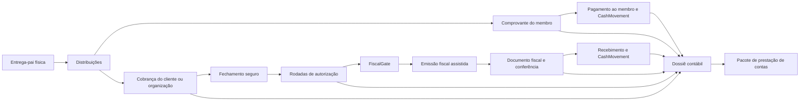
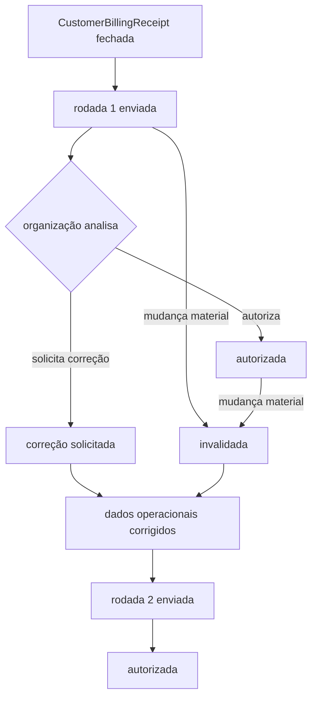
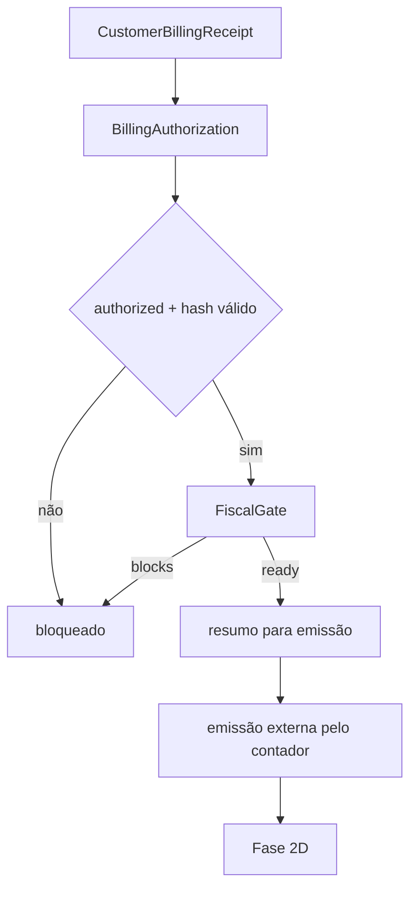

# Arquitetura do Portal Contábil

## Objetivo

O Portal Contábil organiza o ciclo documental e contábil dos projetos de venda sem criar um segundo núcleo financeiro. A Fase 2A estabelece a entrada do portal, permissões, fila de trabalho, lista de processos e o dossiê inicial.

## Verdades preservadas

- `ProductionDelivery` com `parent_delivery_id` preenchido é a única linha financeira operacional.
- A entrega-pai é somente a origem física e aparece no dossiê apenas como rastreabilidade.
- `AssociateReceipt` continua sendo a conta a pagar ao membro.
- `CustomerBillingReceipt` continua sendo a conta a receber do cliente ou organização.
- `CustomerReceiptPayment` e `AssociateReceiptPayment` registram parcelas.
- `CashMovement` continua representando caixa real.
- `Document` continua sendo a estrutura de arquivos e anexos.
- O portal não recalcula snapshots fechados a partir da entrega-pai.

## Limites da Fase 2A

Esta subfase é somente leitura. Ela não:

- fecha ou reabre cobrança;
- cria autorização da organização compradora;
- emite documento fiscal;
- registra pagamento ou recebimento;
- cria pacote de prestação de contas;
- integra diretamente com a SEFAZ.

Os estados de autorização, fiscal e prestação de contas aparecem como `legacy_unsubmitted` ou `not_started`, sem backfill fictício. A Fase 2B, descrita abaixo, implementa somente a autorização da organização e não introduz estado fiscal.

## Componentes

### Entrada e autorização

- Prefixo: `/{tenant}/accounting`.
- O tenant vem do route binding e precisa coincidir com a sessão ativa.
- O acesso é concedido por `view_accounting_portal` e `view_accounting_processes`.
- O controller resolve cada cobrança novamente por `tenant_id + id`; IDs do navegador nunca selecionam tenant.
- O papel `contador` recebe visualização, revisão e solicitação de correção.
- Financeiro, tesouraria e presidência recebem visualização; ações futuras terão permissões próprias.

### Fila de trabalho

`AccountingPortalController::queue()` usa contagens e somas SQL focadas. Categorias com zero itens são removidas da resposta. A fila não executa o auditor completo do projeto.

Categorias atuais:

- inconsistências críticas da cobrança;
- cobranças em preparação;
- processos fechados para conferência;
- recebimentos parciais.

### Processos

A listagem é paginada no servidor, com máximo de 50 registros por requisição. O navegador renderiza tabela no desktop e itens compactos no mobile. Existem filtros por busca, projeto, organização, cliente, período, estado financeiro, autorização, fiscal, prestação de contas e pendência.

Somente os campos necessários são serializados. Relações são carregadas em lote e totais vêm dos snapshots de `CustomerBillingReceipt`.

### Dossiê inicial

O dossiê reúne:

- identificação do projeto e destinatário;
- snapshot bruto, taxas, líquido, recebido e saldo;
- distribuições financeiras vinculadas;
- entrega-pai apenas dentro do bloco `parent` de cada distribuição;
- pagamentos da cobrança;
- comprovantes de membros relacionados pelas distribuições;
- documentos polimórficos da cobrança;
- eventos recentes do `activity_log`;
- verificação focada de integridade.

Nomes de membros são resolvidos em lote por `TenantIdentityService`, sempre usando `tenant_id + user_id`.

## Integridade e desempenho

- APIs respondem com `Cache-Control: no-store, private`.
- Não existe consulta sem filtro explícito de tenant nos endpoints do portal.
- A entrega-pai não entra na coleção financeira retornada.
- A página Blade recebe somente tenant, identificadores autorizados e URLs de API.
- A listagem usa `withCount`, eager loading e paginação.
- O dossiê pagina distribuições em blocos de 25.
- A auditoria focada não altera dados e não substitui `finance:audit-integrity`.

## Evolução prevista

- **2B:** rodadas de autorização da organização, snapshot e invalidação material (implementada).
- **2C:** `FiscalGate`, configuração fiscal mínima e emissão assistida.
- **2D:** documentos fiscais, XML seguro, conferência, cancelamento e substituição.
- **2E:** pagamentos, comprovantes de membros e timeline ampliada no dossiê.
- **2F:** pacote de prestação de contas, completude, PDF índice e ZIP.
- **2G:** notificações, acessibilidade e cenários E2E completos.

## Fluxo final planejado

## Decisões que não devem regredir

1. autorização fiscal e situação financeira são estados distintos;
2. valor bruto, líquido e fiscal não são sinônimos;
3. processos antigos permanecem históricos, sem autorização retroativa inventada;
4. documentos fiscais cancelados ou substituídos não serão apagados fisicamente;
5. qualquer futura escrita crítica deverá usar transação, lock, idempotência e auditoria.

## Fase 2B - autorização da organização

### Auditoria do portal comprador

1. A pessoa entra pelo login global existente, inclusive Google OAuth, e acessa `/{tenant}/buyer`; nenhum novo autenticador foi criado.
2. `EnsureBuyerOrganizationAccess` normaliza o e-mail autenticado e resolve `organization_authorized_emails` por `tenant_id + email + active`. Em rotas de recurso, a organização é escolhida pelo próprio recurso e intersectada com os vínculos autorizados.
3. O schema permite o mesmo e-mail em mais de uma organização. Em uma rota específica, o recurso determina exatamente qual vínculo pode ser usado; na lista genérica há um seletor limitado aos vínculos ativos do próprio e-mail.
4. Projetos permitidos vêm exclusivamente de `sales_project_organizations`; esconder links nunca substitui o filtro no backend.
5. Não existe vínculo direto `user_id -> organization`. O `User` global autentica e o e-mail autorizado identifica o representante dentro do tenant.
6. Cobranças são resolvidas por `tenant_id + organization_id + authorization_id` e ainda precisam pertencer a um projeto participante. IDs alterados manualmente retornam 404.
7. Foram reutilizados `layouts.bento`, `PortalNavigation`, o middleware comprador, o sistema de notificações e as relações já existentes de organização/projeto.

### Decisão de domínio

`BillingAuthorization` representa uma rodada histórica de análise de uma `CustomerBillingReceipt`. Ela é necessária porque um booleano na cobrança não preservaria versão, conteúdo, remetente, destinatário, resposta e invalidação. A rodada não é uma fonte financeira e nunca recalcula caixa, contas a receber ou distribuições.

Não há `SoftDeletes`. Uma rodada termina por estado e permanece auditável. O schema InnoDB contém tenant, cobrança, organização, sequência, estado, snapshot JSON versionado, hashes, chave idempotente e identidades/datas de envio, resposta, invalidação e cancelamento.

### Compatibilidade do banco legado

`billing_authorizations` é criada obrigatoriamente com InnoDB. As instalações antigas do SGC, porém, ainda podem possuir `tenants`, `organizations`, `customer_billing_receipts` ou `users` em MyISAM. O MySQL não permite criar uma FK InnoDB apontando para uma tabela MyISAM; por isso a migration adiciona as FKs físicas somente quando todas as tabelas-pai já usam InnoDB. Em instalações legadas, permanecem as colunas, índices compostos, validações tenant-aware, locks e constraints de unicidade da própria tabela, sem converter silenciosamente tabelas centrais durante o deploy.

Essa compatibilidade evita uma alteração ampla e arriscada de engine, mas a ausência temporária das FKs externas é um risco residual conhecido. A conversão planejada das tabelas-pai para InnoDB e uma migration posterior para instalar as FKs devem ocorrer antes da liberação fiscal. Até lá, o gate da Fase 2C permanece fechado.

### Estados e rodada ativa

- `sent`: enviada e aguardando resposta;
- `authorized`: resposta positiva ainda materialmente válida;
- `correction_requested`: resposta negativa histórica, liberando nova rodada;
- `invalidated`: a versão enviada diverge do estado material atual;
- `cancelled`: encerramento administrativo com motivo.

`active_marker = 1` identifica a única rodada corrente (`sent` ou `authorized`). Estados encerrados usam `NULL`. O índice único `(tenant_id, customer_billing_receipt_id, organization_id, active_marker)` usa o comportamento MySQL de aceitar múltiplos `NULL`, mas rejeitar dois marcadores `1`. A aplicação também valida sob lock.

### Snapshot e hash

`BillingAuthorizationSnapshotService` reconstrói a versão somente no servidor, após reconsulta e locks. O formato atual é `snapshot_version = 1` e congela:

- tenant, projeto, cobrança e período;
- destinatário fiscal e cliente de referência;
- cada distribuição, produto, unidade, quantidade, preço congelado, bruto, taxas, líquido e cliente;
- definições e valores calculados das taxas;
- totais fechados, observações e metadados dos anexos.

Entrega-pai e identidade do produtor não são linhas nem dados apresentados à organização. Preço nunca vem de `project_demands.unit_price`.

O hash é SHA-256 sobre JSON normalizado recursivamente. Chaves de objetos são ordenadas e distribuições, taxas e anexos usam ordem determinística. Chaves técnicas como `updated_at` não entram. Antes do envio, a soma de bruto, taxas e líquido das linhas precisa coincidir com os totais fechados, com tolerância máxima de um centavo.

### Materialidade e validade

São materiais todos os campos exibidos no documento: distribuições adicionadas/removidas, produto, cliente, organização, quantidade, preço, data, período, taxas, totais, destinatário, observações apresentadas e anexos. Timestamp técnico e metadado ausente do snapshot não são materiais.

`BillingAuthorizationValidityService` é a regra central. Uma autorização é válida somente quando a rodada é `authorized` e ativa, o tenant/recibo coincidem, a cobrança permanece em estado financeiro fechado (`pending_payment`, `partially_paid` ou `paid`), não existem inconsistências críticas e o hash atual coincide. Recebimento não altera retroativamente o conteúdo autorizado. Falha ao reconstruir o estado atual resulta em invalidação conservadora, nunca em autorização presumida.

Os observers de `CustomerBillingReceipt` e `ProductionDelivery` fazem invalidação preventiva após commit. A comparação de hash durante a resposta e em gates futuros continua sendo a barreira final.

### Transações e concorrência

Envio e resposta usam a mesma ordem de lock:

1. `CustomerBillingReceipt` por `tenant_id + id`;
2. rodada(s) de autorização;
3. distribuições em ordem de ID e suas entregas-pai na validação financeira.

O envio possui `operation_key` UUID único por tenant. Retry com a mesma chave retorna a rodada criada; uma chave diferente encontra a rodada ativa e é bloqueada. Respostas repetidas iguais são idempotentes; respostas opostas após a primeira transição são recusadas.

### Permissões, portal e auditoria

- `send_accounting_authorizations` envia ou reenvia;
- `cancel_accounting_authorizations` cancela com motivo;
- o acesso ao dossiê continua exigindo as permissões contábeis da Fase 2A;
- a organização só pode visualizar o snapshot e escolher `Autorizar faturamento` ou `Solicitar correção`;
- anexos são baixados por endpoint privado que revalida tenant, organização, projeto, rodada e vínculo do documento;
- administrador em modo de prévia não pode responder pela organização;
- não há override administrativo de autorização.

O `activity_log` registra envio, reenvio, autorização, correção, invalidação e cancelamento. Nomes históricos internos usam resolução tenant-aware; o nome do representante comprador vem do vínculo autorizado e é congelado na resposta.

Notificações reutilizam `TenantNotificationDispatcher`: envio/reenvio vai somente a contas globais ativas cujos e-mails estejam autorizados naquela organização; respostas e invalidações vão aos papéis configurados do tenant. URLs continuam protegidas pelo middleware e pelas consultas tenant-aware.

### Legado e desempenho

Cobranças sem rodada aparecem como `Processo anterior ao workflow`, sem backfill. Elas podem iniciar uma rodada real apenas se o estado atual passar pelas validações.

Listagens usam eager loading, contagens SQL e paginação. Snapshot histórico é lido do JSON e nunca reconstruído para exibição. A organização recebe apenas os dados mínimos da cobrança; identidade de produtor não é serializada.

## Fase 2C - Fiscal Gate e preparação para emissão

### Auditoria e armazenamento

- emitente continua em `tenants` (`legal_name`, `cnpj` e endereço);
- destinatários continuam em `organizations` e `customers`, sem duplicação cadastral;
- `SalesProject` fornece o escopo opcional do projeto;
- settings genéricos e JSON existentes não oferecem ao mesmo tempo versionamento imutável, uma versão ativa por escopo, fingerprint e FKs tenant-aware.

Foi criada `fiscal_profiles`, tabela InnoDB de configuração sem valores financeiros e sem representar nota fiscal. O padrão usa `scope_key = tenant`; override usa `scope_key = project:{id}`. A resolução é projeto ativo, depois tenant ativo. Cada salvamento cria nova versão e preserva as anteriores. A concorrência é serializada pelo registro do tenant e protegida por índices únicos.

### Gate central

`FiscalGateService` é a única autoridade de prontidão e retorna `ready`, `status`, `blocks`, `warnings`, `checks`, valor esperado, documento, autorização e perfil. Códigos estáveis incluem `tenant_mismatch`, `financial_integrity_error`, `authorization_missing`, `authorization_invalid`, `authorization_tenant_mismatch`, `authorization_receipt_mismatch`, `recipient_mismatch`, `fiscal_profile_missing`, `fiscal_profile_inactive`, `document_type_missing`, `fiscal_amount_source_missing`, `issuer_incomplete`, `issuer_address_incomplete`, `recipient_incomplete` e `fiscal_amount_unresolved`.

O valor fiscal esperado vem exclusivamente de `BillingAuthorization.snapshot.totals.gross` ou `.net`, conforme enum controlado. O hash material atual precisa coincidir. `billing_status`, entrega-pai, taxa do produtor e `admin_fee_percentage` não participam dessa decisão.

### Portal e segurança

`/{tenant}/accounting/fiscal` usa paginação e payload mínimo. O Gate completo roda nos itens da página, no dossiê aberto e novamente no `POST` de preparação. A preparação usa o snapshot autorizado, é somente leitura e se identifica como resumo, nunca como nota fiscal.

Permissões: `view_accounting_fiscal_queue`, `prepare_accounting_fiscal`, `view_accounting_fiscal_settings` e `manage_accounting_fiscal_settings`. Presidente não recebe alteração implicitamente. Controllers resolvem tenant pela rota, filtram recursos por `tenant_id`, usam `no-store, private` e registram perfil e preparação no activity log. Nenhuma fila ou prontidão derivada foi persistida.

XML, PDF fiscal, chave, upload, parser, SEFAZ/NFS-e e prestação de contas permanecem fora da Fase 2C.

## Evidências operacionais de conferência

Uma `CustomerBillingReceipt` pode ser preparada a partir da união das distribuições de uma ou mais `DeliveryConferenceSheet` aprovadas e ainda materialmente válidas. A folha é apenas evidência operacional anterior à cobrança: não fornece preços, taxas, totais nem autorização fiscal. O fluxo financeiro reconsulta os IDs em `CustomerBillingReceiptService`, que permanece a única autoridade de valores. No futuro, o dossiê contábil poderá listar essas folhas como evidências relacionadas, sem torná-las requisito universal do `FiscalGate`.
